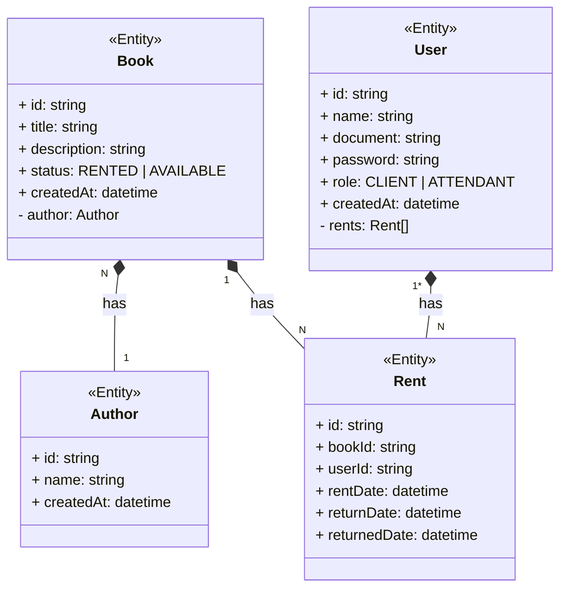

# Arquitetura


# Endpoints

#### [POST] Realizar login

URL: `/auth`
Request:

```json
{
  "document": "29737520009",
  "password": "FN57akyScx"
}
```

Response:

```json
{
  "token": "jwt token"
}
```

#### [POST] Realizar cadastro de cliente (pelo app)

URL: `/user`
Request:

```json
{
  "name": "Joao da Silva",
  "document": "29737520009",
  "password": "FN57akyScx"
}
```

Response:

```json
{
  "id": "uuidv4"
}
```

#### [POST] Realizar cadastro de cliente (pelo site = funcionario cadastrando alguem)

URL: `/admin/user`
Headers: Authentication
Request:

```json
{
  "name": "Joao da Silva",
  "document": "29737520009"
}
```

Response:

```json
{
  "id": "uuidv4",
  "password": "FN57akyScx"
}
```

#### [PUT] Atualizar senha cliente

URL: `/user`
Headers: Authentication
Request:

```json
{
  "currentPassword": "FN57akyScx",
  "newPassword": "FN57akyScx222"
}
```

Response:

`200 OK`

#### [GET] Buscar livros

URL: `/book`
Request:

`/book?page=0`
`/book?page=0&search=nome_livro`

Response:

```json
[
  {
    "id": "uuidv4",
    "title": "A Cabana",
    "status": "RENTED | AVAILABLE",
    "returnDate": "2024-04-17T20:19:57.164Z"
  }
]
```

#### [GET] Buscar detalhes de um livro (cliente)

URL: `/book/{id}`
Request:

`/book/cedw123123`

Response:

```json
{
  "id": "uuidv4",
  "title": "A Cabana",
  "description": "Bla bla bla",
  "author": "Fulano de tal",
  "status": "RENTED | AVAILABLE",
  "returnDate": "2024-04-17T20:19:57.164Z"
}
```

#### [GET] Buscar detalhes de um livro (atendente)

URL: `/book/{id}`
Headers: Authentication
Request:

`/book/cedw123123`

Response:
Obs: objeto user, rentDate e returnDate vem null caso status seja AVAILABLE

```json
{
  "id": "uuidv4",
  "title": "A Cabana",
  "description": "Bla bla bla",
  "author": "Fulano de tal",
  "status": "RENTED | AVAILABLE",
  "rentDate": "2024-04-17T20:19:57.164Z",
  "returnDate": "2024-04-17T20:19:57.164Z",
  "user": {
    "name": "Joao da Silva",
    "document": "29737520009"
  }
}
```

#### [POST] Realizar reserva de um livro (cliente)

URL: `/rent`
Headers: Authentication
Request:

```json
{
  "bookId": "uuidv4"
}
```

Response:

```json
{
  "returnDate": "2024-04-17T20:19:57.164Z"
}
```

#### [POST] Realizar reserva de um livro (atendente)

URL: `/rent`
Headers: Authentication
Obs: o endpoint eh o mesmo, a diferenca eh que aqui mandamos o token no header, e na api devemos validar se tem token e
se o portador do token eh do tipo atendente
Request:

```json
{
  "userDocument": "29737520009",
  "bookId": "uuidv4"
}
```

Response:

```json
{
  "returnDate": "2024-04-17T20:19:57.164Z"
}
```

#### [GET] Visualizar meus alugueis (cliente)

URL: `/rent`
Headers: Authentication
Request:

`/rent?page=0`

Response:

```json
[
  {
    "id": "uuidv4",
    "bookTitle": "A Cabana",
    "status": "RENTED | AVAILABLE",
    "returnDate": "2024-04-17T20:19:57.164Z"
  }
]
```

#### [GET] Visualizar detalhes de um cliente

URL: `/user/{document}`
Headers: Authentication
Obs: so pode ser feito por um usuario do tipo atendente
Request:

`/user/29737520009`

Response:

```json
{
  "document": "29737520009",
  "name": "Joao da Silva",
  "role": "CLIENT | ATTENDANT",
  "booksRentedAmount": 10,
  "currentRentedBooks": [
    {
      "id": "uuidv4",
      "name": "A Cabana"
    }
  ]
}
```

#### [POST] Resetar senha de um usuario

URL: `/user/reset-password`
Headers: Authentication
Obs: so pode ser feito por um usuario do tipo atendente
Request:

```json
{
  "document": "29737520009"
}
```

Response:

```json
{
  "password": "senha gerada automaticamente"
}
```

#### [POST] Dar baixa na devolucao de um livro

URL: `/rent/return`
Headers: Authentication
Obs: so pode ser feito por um usuario do tipo atendente
Request:

```json
{
  "userDocument": "29737520009",
  "bookId": "uuidv4"
}
```

Response:

`200 OK`

#### [POST] Cadastrar livro

URL: `/book`
Headers: Authentication
Obs: so pode ser feito por um usuario do tipo atendente
Request:

```json
{
  "name": "A Cabana",
  "Description": "Bla bla bla",
  "authorId": "Joao da Silva"
}
```

Response:

`200 OK`

#### [GET] Buscar usuarios

URL: `/user`
Headers: Authentication
Obs: so pode ser feito por um usuario do tipo atendente
Request:

`/user?page=0`
`/user?page=0&search=document_or_name`

Response:

```json
[
  {
    "name": "Joao da Silva",
    "document": "29737520009"
  }
]
```


