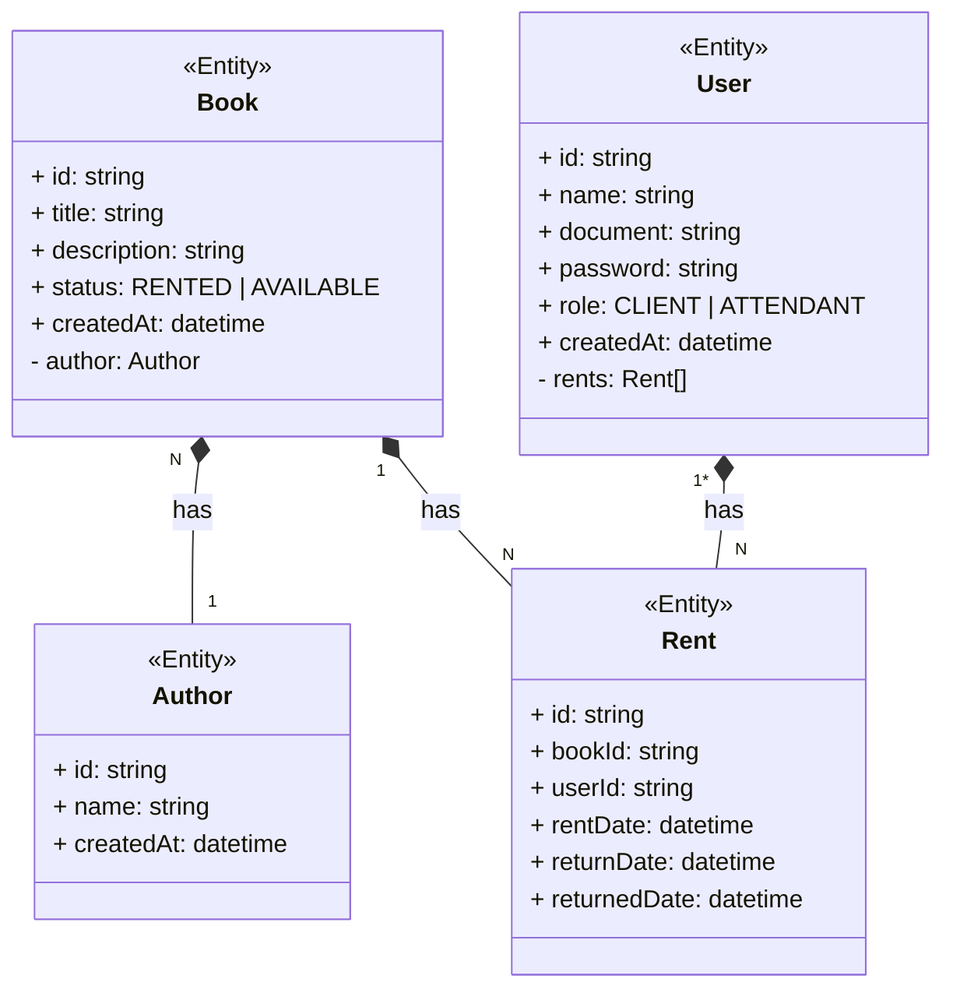

# Solution Architecture


# Endpoints

#### [POST] Login

URL: `/auth`
Request:

```json
{
  "document": "29737520009",
  "password": "FN57akyScx"
}
```

Response:

```json
{
  "token": "jwt token"
}
```

#### [POST] Sign up customer

URL: `/user`
Request:

```json
{
  "name": "Joao da Silva",
  "document": "29737520009",
  "password": "FN57akyScx"
}
```

Response:

```json
{
  "id": "uuidv4"
}
```

#### [POST] Sign up employee

URL: `/admin/user`
Headers: Authentication
Request:

```json
{
  "name": "Joao da Silva",
  "document": "29737520009"
}
```

Response:

```json
{
  "id": "uuidv4",
  "password": "FN57akyScx"
}
```

#### [PUT] Update customer password

URL: `/user`
Headers: Authentication
Request:

```json
{
  "currentPassword": "FN57akyScx",
  "newPassword": "FN57akyScx222"
}
```

Response:

`200 OK`

#### [GET] Search books

URL: `/book`
Request:

`/book?page=0`
`/book?page=0&search=nome_livro`

Response:

```json
[
  {
    "id": "uuidv4",
    "title": "A Cabana",
    "status": "RENTED | AVAILABLE",
    "returnDate": "2024-04-17T20:19:57.164Z"
  }
]
```

#### [GET] Search for book (client)

URL: `/book/{id}`
Request:

`/book/cedw123123`

Response:

```json
{
  "id": "uuidv4",
  "title": "A Cabana",
  "description": "Bla bla bla",
  "author": "Fulano de tal",
  "status": "RENTED | AVAILABLE",
  "returnDate": "2024-04-17T20:19:57.164Z"
}
```

#### [GET] Search for book (employee)

URL: `/book/{id}`
Headers: Authentication
Request:

`/book/cedw123123`

Response:
Obs: user object, rentDate and returnDate will be null when status is AVAILABLE

```json
{
  "id": "uuidv4",
  "title": "A Cabana",
  "description": "Bla bla bla",
  "author": "Fulano de tal",
  "status": "RENTED | AVAILABLE",
  "rentDate": "2024-04-17T20:19:57.164Z",
  "returnDate": "2024-04-17T20:19:57.164Z",
  "user": {
    "name": "Joao da Silva",
    "document": "29737520009"
  }
}
```

#### [POST] Rent a book (customer)

URL: `/rent`
Headers: Authentication
Request:

```json
{
  "bookId": "uuidv4"
}
```

Response:

```json
{
  "returnDate": "2024-04-17T20:19:57.164Z"
}
```

#### [POST] Rent a book (customer)

URL: `/rent`
Headers: Authentication
PS: The endpoint is the same, the differnce is that here we send the token on the header, and we validathe the token on the API and check if user is of employee type.

Request:

```json
{
  "userDocument": "29737520009",
  "bookId": "uuidv4"
}
```

Response:

```json
{
  "returnDate": "2024-04-17T20:19:57.164Z"
}
```

#### [GET] Check rents (customer)

URL: `/rent`
Headers: Authentication
Request:

`/rent?page=0`

Response:

```json
[
  {
    "id": "uuidv4",
    "bookTitle": "A Cabana",
    "status": "RENTED | AVAILABLE",
    "returnDate": "2024-04-17T20:19:57.164Z"
  }
]
```

#### [GET] View customer details

URL: `/user/{document}`
Headers: Authentication
PS: Can be used just by employees
Request:

`/user/29737520009`

Response:

```json
{
  "document": "29737520009",
  "name": "Joao da Silva",
  "role": "CLIENT | ATTENDANT",
  "booksRentedAmount": 10,
  "currentRentedBooks": [
    {
      "id": "uuidv4",
      "name": "A Cabana"
    }
  ]
}
```

#### [POST] Reset customer password

URL: `/user/reset-password`
Headers: Authentication
PS: Can be used just by employees
Request:

```json
{
  "document": "29737520009"
}
```

Response:

```json
{
  "password": "senha gerada automaticamente"
}
```

#### [POST] Return a book to the stock

URL: `/rent/return`
Headers: Authentication
PS: Can be used just by employees
Request:

```json
{
  "userDocument": "29737520009",
  "bookId": "uuidv4"
}
```

Response:

`200 OK`

#### [POST] Register a new book

URL: `/book`
Headers: Authentication
PS: Can be used just by employees
Request:

```json
{
  "name": "A Cabana",
  "Description": "Bla bla bla",
  "authorId": "Joao da Silva"
}
```

Response:

`200 OK`

#### [GET] Seach users

URL: `/user`
Headers: Authentication
PS: Can be used just by employees
Request:

`/user?page=0`
`/user?page=0&search=document_or_name`

Response:

```json
[
  {
    "name": "Joao da Silva",
    "document": "29737520009"
  }
]
```


